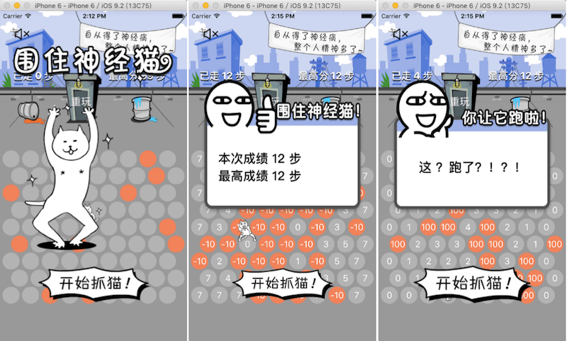

# NerveCat

围住神经猫游戏算法的实现，objc版本 和 javascript版本

## 源起

看了围住神经猫这个小游戏后感觉我也能做一个一样的这样的游戏，于是便拿来练手，感觉这个游戏还是挺锻炼逻辑思维的

## 简介

- 游戏分为Object—C版本 和 JavaScript版本
- javascript 版本相比 Object—C版本缺少了一些动画效果

## 游戏规则

1. 点击屏幕上的灰色原点给猫设置障碍，以围住猫
2. 给猫添加一个障碍算做一步
3. 游戏的最高分是围住猫的最小步数

## 游戏界面

Object—C 版本游戏截图

 

